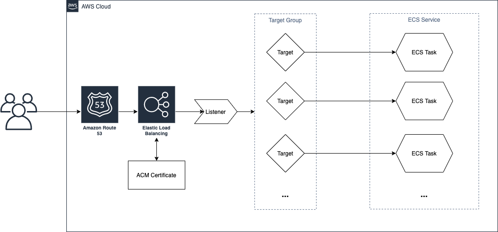
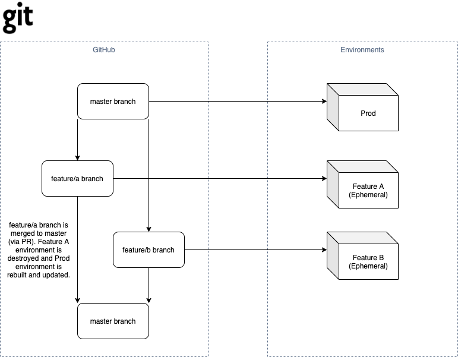
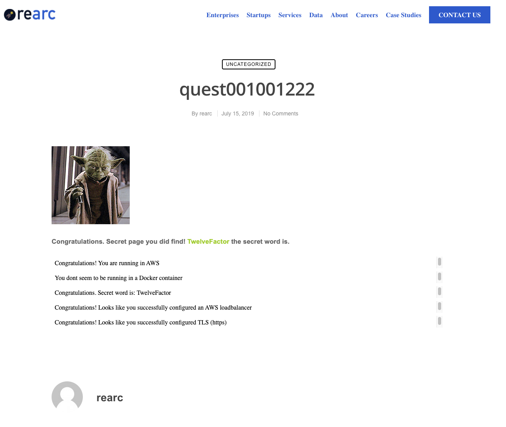

# Submission
## Overview
The docker image is built and pushed to AWS ECR. I use an ECS Task Definition along with an ECS Service (Fargate) to run the container. An AWS Application Load Balancer is used to target and send traffic to running tasks within ECS. Attached to the ALB is an ACM Certificate (*.nicholashofbauer.com). And lastly, I provisione a Route53 record to point to the ALB dns name.

## CI/CD
Build, deploy and destroy (of feature envs only) happen automatically using GitHub Actions. The build and deploy workflow can be found here: [.github/workflows/build_deploy.yml](.github/workflows/build_deploy.yml). This workflow is started automatically on commits to `master` and `feature/*` branches. Feature environment names are computed using the short hash of its corresponding branch name. This is done with a custom GitHub Action found here: [.github/actions/git-env/](.github/actions/git-env/). When a pull request from a feature branch to master is merged, the feature branch should be deleted which starts the destroy workflow found here: [.github/workflows/destroy.yml](.github/workflows/destroy.yml). This basically runs the terraform destroy command to deprovision the feature environment and all resources associated with it in AWS.

## Terraform
Terraform templates can be found under the [infra/](infra/) directory using the latest version of terraform (0.15.0).

## Docker
Dockerfile was added under the root directory of the repository [Dockerfile](Dockerfile)

## Screenshot
**Note:** It doesn't seem to recognize that it's running in a docker eventhough it's deployed in ECS/Fargate.

## URL of Prod Environment
[https://quest.nicholashofbauer.com](https://quest.nicholashofbauer.com)

## URL of Feature (Ephemeral) Environments
https://quest-{short hash of branch name}.nicholashofbauer.com